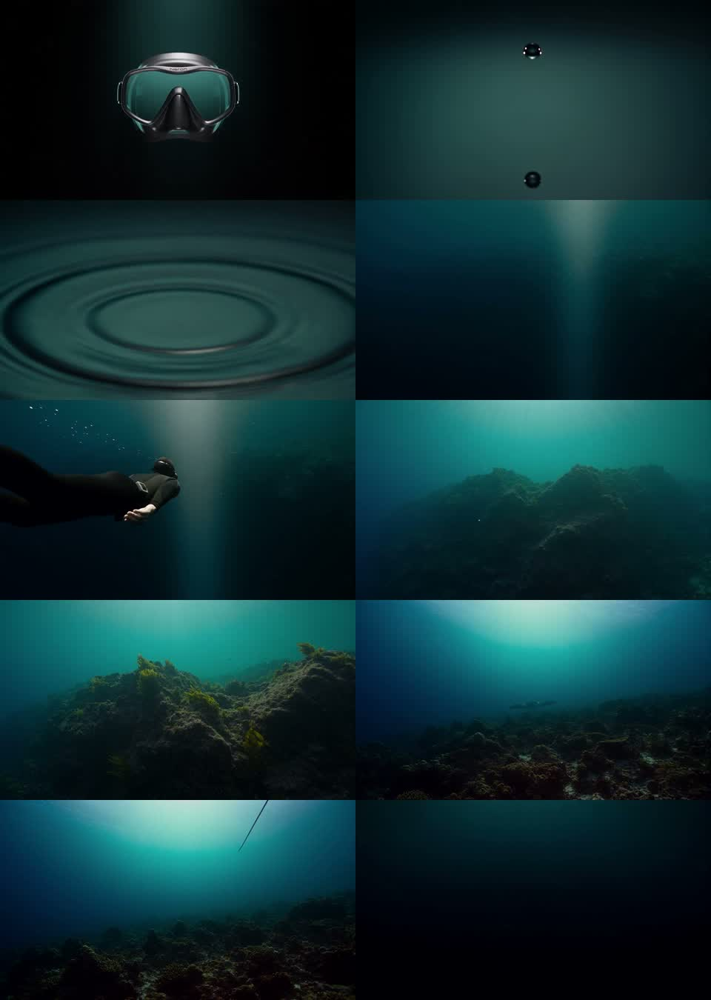

# Opening transition audit — 2026-10-04

## Playback improvement — 2026-10-05

Existing footage retained. Opening joins now span 1.15 viewport heights rather than 0.9; later scene lengths increase to preserve reading holds, giving 21.65 viewport-height timeline units. A reversible, softly graded waterlight overlay reaches at most 26% opacity during joins, with no opaque blackout, and fine-pointer screens use a restrained 3.5% forward media drift. Chapter text fades as a whole as well as per-letter to reduce stray lettering across scene changes. No extra media/decoder layers are added. Thirteen tests pass, including new seam symmetry/endpoint tests. First mask/ripple join inspected in-browser with outgoing opacity 1, incoming approximately .34 and waterlight approximately .23. This is a smoother editorial transition, **not a repair of the source geometry differences documented below**. No generation credits spent.

## Method and limits

`audit-media.sh` extracts a near-final frame (approximately 0.1 seconds before EOF) and the first decoded frame of the next served clip. The left image is outgoing; the right is incoming. These contact sheets assess composition and source continuity, not every frame in each browser dissolve. They are **not exact final-frame exports suitable for conditioning a new generation**. Extract the actual final frame separately before production.

The browser blends overlapping, concurrently advancing clips; therefore these endpoint pairs are not a literal screenshot of the live crossfade. Unit tests separately confirm overlapping opacity coverage. A passing opacity test prevents a mathematical gap but does not prove matching geometry or absence of decoder glitches.

## Findings

| Join | Observed boundary | Assessment | Suggested repair before claiming a continuous flight |
| --- | --- | --- | --- |
| 1 Mask → ripple | Full mask portrait becomes a suspended droplet/reflection. | Clear subject and scale discontinuity; similar teal palette only. | A lens-to-water connector using actual boundary frames; establish a believable camera path. |
| 2 Ripple → diver | Circular surface ripple becomes an empty underwater light shaft. | No shared surface geometry; direction is only implied. | Continue through the ripple beneath the surface into the incoming light shaft. |
| 3 Diver → reef | Diver near the camera disappears; reef appears with brighter cyan lighting. | Subject, geometry and exposure discontinuity. | Continue the diver's movement while revealing the reef, preserving travel direction and light. |
| 4 Reef → manta | Related reef setting, but rocks, horizon/framing and overhead light differ. | Closest thematic match; not frame-matched. | Re-render/bridge from the actual reef endpoint with consistent terrain and camera pose. |
| 5 Manta → light | Bright overhead glow and exiting manta tail become a darker open-water view. | Exposure and composition discontinuity. | Maintain light source and camera trajectory while manta leaves; settle on the next opening frame. |

**Conclusion:** all five joins are styled dissolves, not demonstrated frame-matched transitions. No new generations or source changes were made in this audit. Do not mark the assignment's continuous-journey requirement complete yet.

## Proof workflow to perform next

1. Select one outgoing scene and incoming scene.
2. Extract their exact relevant boundary frames and inspect camera, subject, colour and lighting.
3. Prepare a connector prompt and review the chosen Magnific model's current start/end conditioning support and cost.
4. Obtain approval for the paid test before generating.
5. Inspect the connector's actual first/last frames; revise or continue neighbouring clips if needed. Model support is not a guarantee of exact frame matching.
6. Encode clips consistently and test both joins slowly and rapidly, forward and backward.
7. Record prompts, generation IDs, settings, credit usage, dates and approval evidence. Only then repeat the method for remaining joins.

An editorial montage may be visually successful, but requires teacher acceptance if substituted for the brief's continuous connected-world approach.
